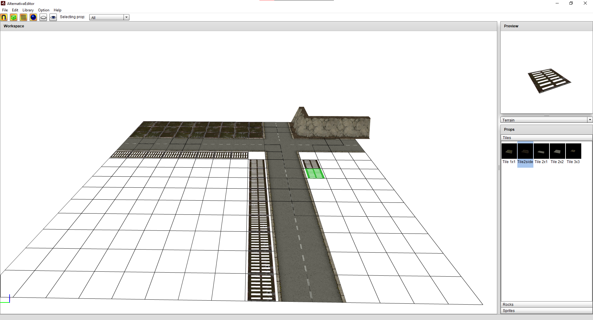

# alternativa-editor
AlternativaEditor taken from the 2010 Alternativa Platform leak.

## Info
This is an old version of AlternativaEditor that doesn't fully support the commonly used proplibs properly, it can load some but not necessarily fully and it doesn't like folders inside folders (the parent folder likely doesn't have a library.xml so it errors).

## Building
### Requirements
- vscode
- as3mxml vscode plugin
- AIRSDK 51 (the original is built using 1.5 so will probably build with most versions as long as you edit the descriptor) + FLEX
### Build
Make sure to select your SDK in vscode and then execute a build task (`ctrl+shift+b`), the output files should be placed inside `build/` that can the be packed into an air bundle or captive runtime.